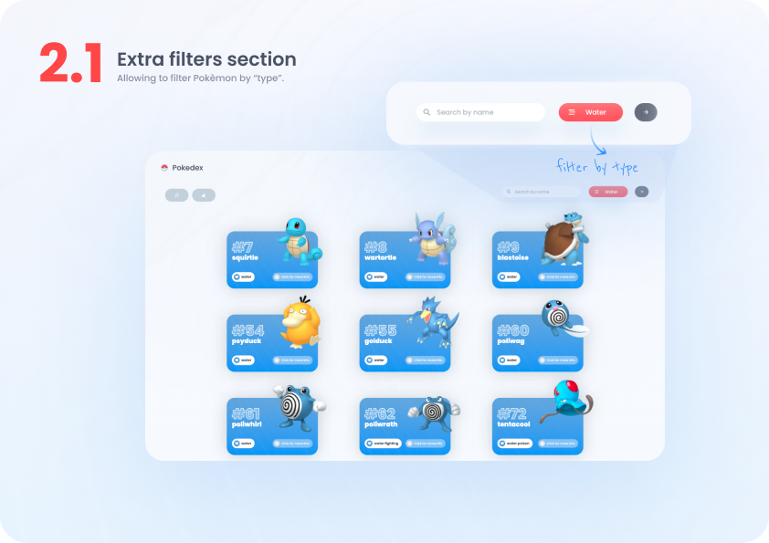
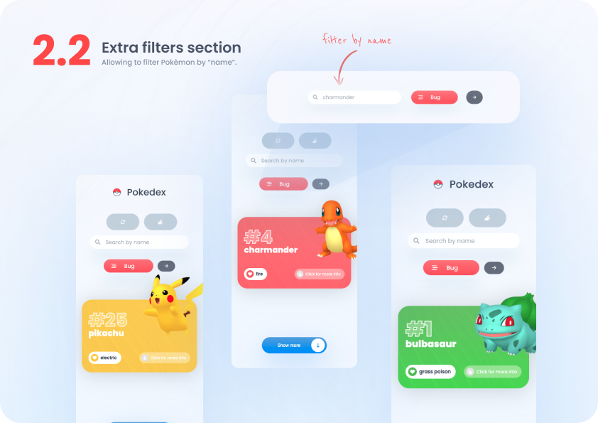
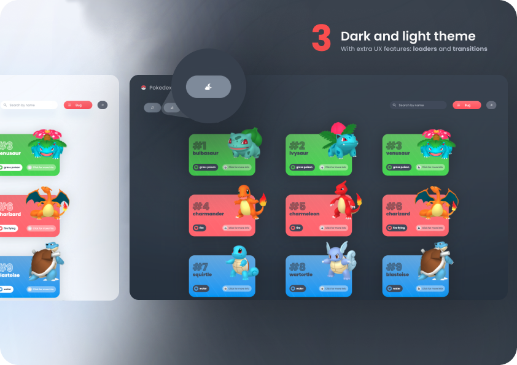

  
  
  
  
   

#Pokedex
**Katarzyna Poręba**   
katarzynaporeba@icloud.com 
---
**Core technology stack:** React  
**Extra-features:**
- Extra filter section. Allows filtering pokemons by type or name (Form component) 
- Dark and light theme (Switching between two themes with second button)
- Custom loader (Created with svg file)
- Transitions (Scale, color, background, drop-shadow)

